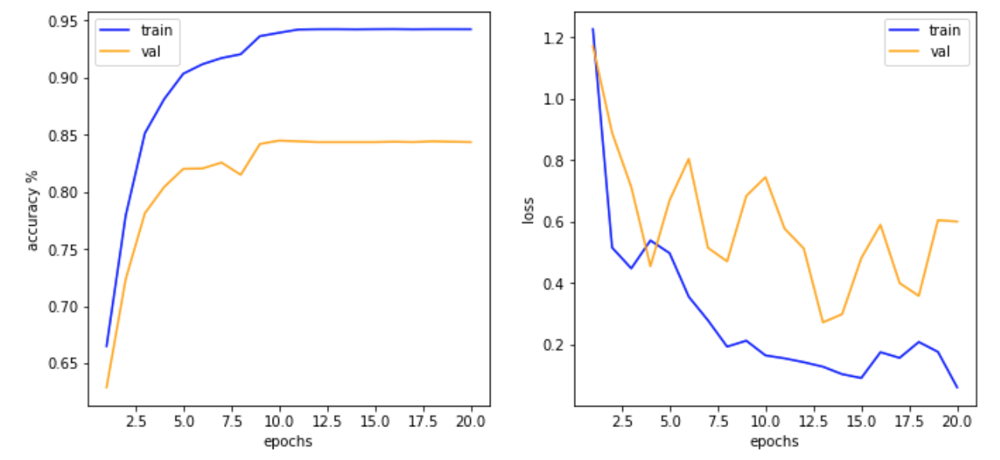
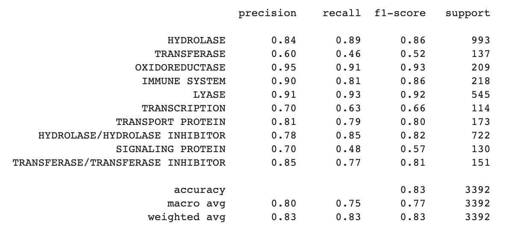
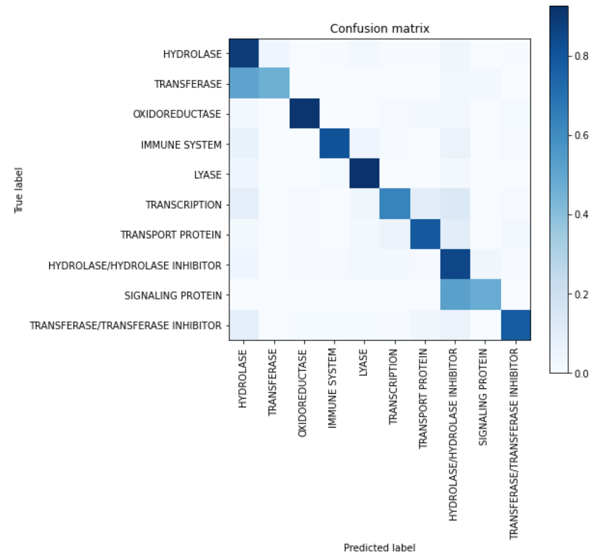

# Sequence models for protein classification

### Introduction
#### Data
Protein sequence and labels available on Kaggle dataset

dataset: https://www.kaggle.com/shahir/protein-data-set

#### Objective
Inferring the properties of a protein from its amino acid sequence is one of the key problems in bioinformatics.

We propose a method to classify 10 common proteins directly from their sequence of 20 amino acids

### Model

We used a CNN & BiLSTM model in a similar way to what is done in sentiment analysis. The CNN is able to extract spacial features from an embedded sequence of proteins. A bidirectionnal LSTM is a powerful tool for sequence prediction and classification. A protein sequence has no predefinite order of lecture, that is why a bidirectional LSTM is preffered here. Both CNN and LSTM outputs are concatenated and passed through 2 fully connected layers to extract a final classication. Droupout is used between each sub-model blocks. 

### Training 

We trained the model on the 10 most common proteins. Only proteins of length < 2000 were kept to tame long computational times. Gradient clipping was used to prevent exploding/vanishing gradients, a common problem for LSTM models.

GPU Used: Tesla P100 PCIe 16GB

### Results 

The model was evaluated on a test set of 3000 sequences.

Total test accuracy: 83% 

